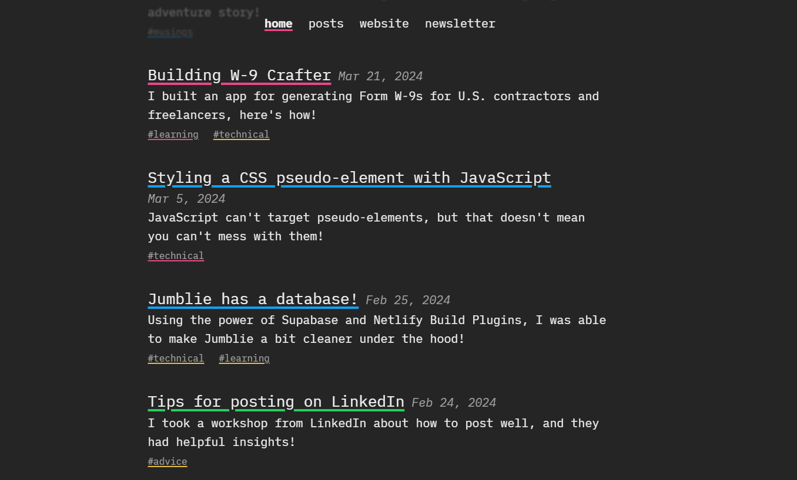

# Article-Recommendation-System

Steps to run the project:

 - Download the repo in your directory
 - Open the terminal and navigate to the project directory
 - Run the command `npm install`
 - Run the command `pip install scikit-learn`
 - Once all dependencies are installed, run `nodemon server.js`
 - Enter a query on the webpage and hit enter to see the results

Changes to make in the project:

- Changes for article_recommender.py:
    - Update the code to fetch the following info from the JSON file:
        - [x] Author name
        - [ ] Article text snippet (max 100 words)
    - Add the following routes to server.js:
        - [ ] `Discover` route will contain the form to get recommendations
        - [x]  `About` route that will show information regarding the entire project
        - [x] `Sign-Up` route will contain a sign-up form
        - [x] `Login` route will contain a login form
        - [ ] `Articles` route will contain all the articles on a single page
        - [x] `Home` route shall be our landing page
    - Add the following to views directory:
        - [ ] `discover.ejs` will be connected to `/discover`
        - [x] `about.ejs` will be connected to `/about`
        - [x] `sign-up.ejs` will be connected to `/signup`
        - [x] `login.ejs` will be connected to `/login`
        - [ ] `articles.ejs` will be connected to `/articles`
        - [x] `home.ejs` will be connected to `/home`
- To make the following UI changes:
    - Update the header with the following information:
        - [x] Change title of project to ArticleScout (title will be on the top left)
        - Add links to the top right:
            - [x] Home
            - [x] Discover
            - [x] Articles
            - [x] About
            - [x] Signup
            - [x] Login
        - Make sure the active page is highlighted.
    - [x] Set a font for the title
    - [x] Set a font for the content
    - [x] Update the articles page to be similar to this 
    - [x] The header and footer inspiration can be taken from [blog.cassidoo.co](https://blog.cassidoo.co/)
    - Update the footer with the following information:
        - [x] Change title of project to ArticleScout (title will be at the top of the stack)
        - [x] Add names of all the team members (on the in the middle of the stack)
        - [x] Add name of the guide (at the bottom of the stack)
